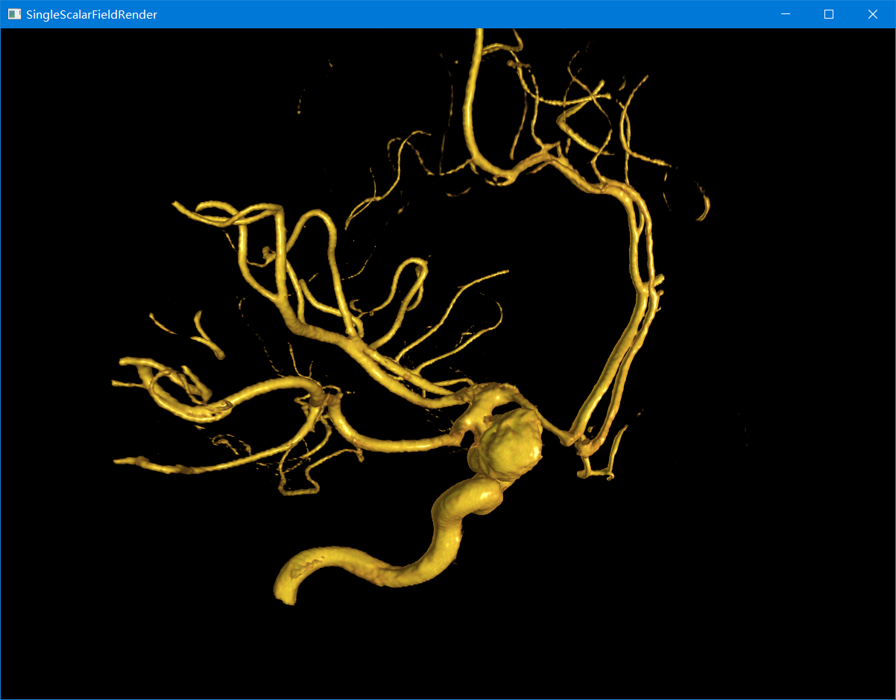
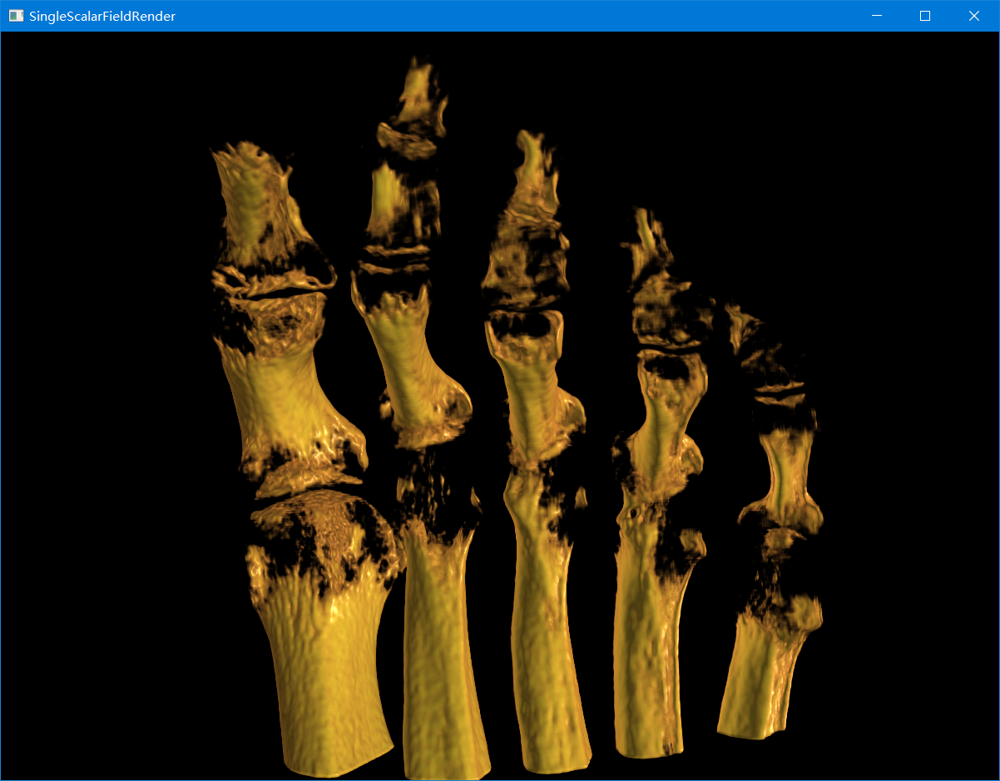
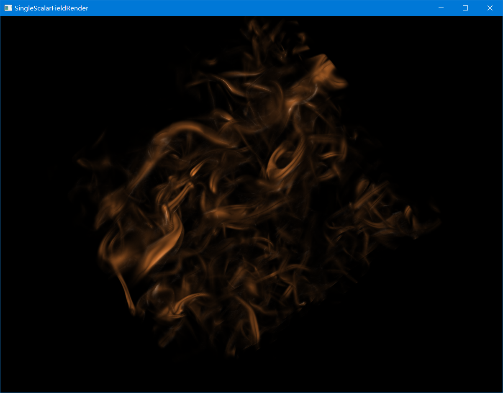
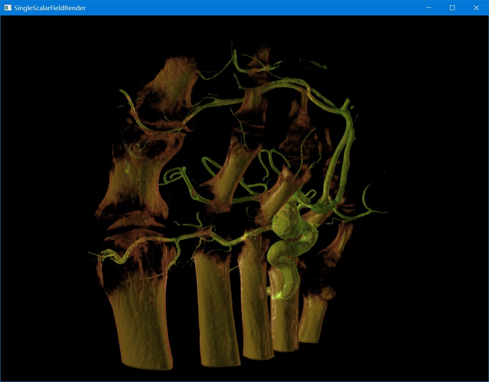
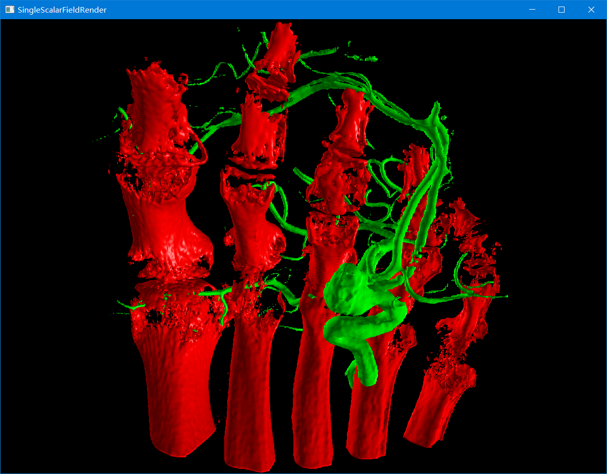
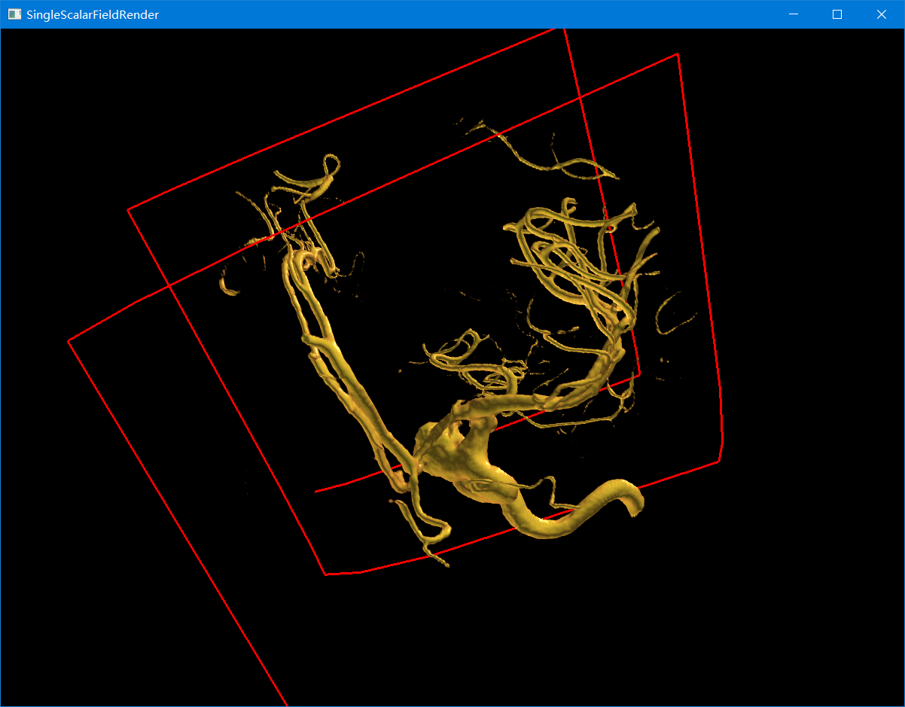

# MultiVolumeRender
## Build
    mkdir build && cd build
    cmake ..
    cmake --build .
## Usage
    测试程序里的数据路径都是相对路径，运行时需要改变程序的运行目录，可以在```test_data/```目录下运行可执行程序
## 数据
```
测试数据均可从该网址下载 https://klacansky.com/open-scivis-datasets/
测试数据需要以 name_x_y_z_type.raw(aneurism_256_256_256_uint8.raw) 格式命名才能加载
```
## 第三方库
```
glad 用于OpenGL API加载
glfw 窗口库
glm 数学库
spdlog 日志库
```
```
使用cmake build的时候会自动下载glfw glm spdlog 但是从Github上下载的源码 可能需要VPN
```
## 编译运行
虽然是以静态库的形式提供 但是在`MultiIsoSurfaceRneder.cpp` `MultiScalarFieldRender.cpp`
`ScalarAndVectorFieldRender.cpp` `SingleScalarFieldRender.cpp` 都定义了相同的全局回调函数对象 
这是因为使用的窗口库GLFW是一个C库 只能注册C类型的函数指针 所以链接库`LibMultiVolumeRenderer`时
一个程序只能生成一个渲染器实例 其实每个渲染器的代码部分都有很多重复的部分 可以抽象为一个基类
## 1.SingleScalarField 单个标量场的直接体渲染
```c++
    //加载数据和设置渲染器的时候可能会抛出异常
    try
    {
        ScalarFieldData scalarFieldData;
        const char *file_name = "mouselod6_366_463_161_uint8.raw";
        //从文件名获取数据的xyz和类型
        SetDimAndTypeByFileName(file_name, scalarFieldData);
        //加载数据并将其拉伸到0-255(uint8) 会保留原始数据的最大值和最小值
        //拉伸公式: x'=(x-min)/(max-min)*255
        LoadRawVolumeData(file_name, scalarFieldData);
        //初始化渲染器窗口大小
        SingleScalarFieldRender singleScalarFieldRender(1200, 900);
        singleScalarFieldRender.SetScalarFieldData(std::move(scalarFieldData));
        //定义传输函数 每个key对应一个color 范围都是0.0-1.0
        TransferFunc tf;
        tf.AddTFPoint({0.0, {0.0, 0.0, 0.0, 0.0}});
        tf.AddTFPoint({0.5, {0.9, 0.5, 0.2, 0.0}});
        tf.AddTFPoint({1.0, {1.0, 1.0, 0.2, 1.0}});
        singleScalarFieldRender.SetTransferFunc(std::move(tf));
        //渲染
        singleScalarFieldRender.Render();
    }
    catch (const std::exception &err)
    {
        LOG_ERROR(err.what());
    }
```
### 一些绘制结果
* aneurism_256_256_256_uint8.raw

* foot_256_256_256_uint8.raw

* tacc#turbulence_256_256_256_float32.raw


## 2.MultiScalarField 两个标量场的直接体渲染
代码与单个标量场的类似 但是要保证 **两个数据的维度xyz一样** 类型可以不同
* 直接体绘制的混合原理
```c++
    sample_color1.rgb=phongShading(sample_pos_in_tex,sample_color1.rgb,ray_direction,1);
    sample_color2.rgb=phongShading(sample_pos_in_tex,sample_color2.rgb,ray_direction,2);
    //每个体贡献一半的颜色进行混合
    vec4 sample_color=sample_color1*0.5f+sample_color2*0.5f;
    color=color + sample_color*vec4(sample_color.aaa,1.f)*(1.f-color.a);
```
### 绘制结果
* aneurism_256_256_256_uint8.raw & foot_256_256_256_uint8.raw


## 3.MultiIsoSurface 两个标量场的等值面绘制
```c++
    try
    {
        ScalarFieldData scalarFieldData1;
        const char *file_name = "aneurism_256_256_256_uint8.raw";
        SetDimAndTypeByFileName(file_name, scalarFieldData1);
        LoadRawVolumeData(file_name, scalarFieldData1);
        ScalarFieldData scalarFieldData2;
        file_name = "foot_256_256_256_uint8.raw";
        SetDimAndTypeByFileName(file_name, scalarFieldData2);
        LoadRawVolumeData(file_name, scalarFieldData2);
        MultiIsoSurfaceRender multiIsoSurfaceRender(1200, 900);
        multiIsoSurfaceRender.SetScalarFieldData(std::move(scalarFieldData2), std::move(scalarFieldData1));
        //等值面的值需要转换到0.0-1.0
        double iso_value1 =
            1.0 * (127 - scalarFieldData1.min_scalar) / (scalarFieldData1.max_scalar - scalarFieldData1.min_scalar);
        double iso_value2 =
            1.0 * (200 - scalarFieldData2.min_scalar) / (scalarFieldData2.max_scalar - scalarFieldData2.min_scalar);
        //设置等值面的值和对应的颜色
        multiIsoSurfaceRender.SetIsoValueAndColor(iso_value1, {1.0, 0.0, 0.0, 1.0}, iso_value2, {0.0, 1.0, 0.0, 1.0});
        multiIsoSurfaceRender.Render();
    }
    catch (const std::exception &err)
    {
        LOG_ERROR(err.what());
    }

```
* 等值面混合绘制原理
```c++
    //如果该处恰好都位于两个体等值面上 那么各自贡献一半的颜色进行混合
    if(scalar1>=iso_value1 && outside1 && scalar2>=iso_value2 && outside2){

        color.rgb = phongShading(sample_pos_in_tex,color1.rgb,ray_direction,1)*0.5
                   +phongShading(sample_pos_in_tex,color2.rgb,ray_direction,2)*0.5;
        color.a=color1.a*0.5+color2.a*0.5;
        break;
    }
    else if(scalar1>=iso_value1 && outside1){
        color.rgb=phongShading(sample_pos_in_tex,color1.rgb,ray_direction,1);
        color.a=color1.a;
        break;
    }
    else if(scalar2>=iso_value2 && outside2){
        color.rgb=phongShading(sample_pos_in_tex,color2.rgb,ray_direction,2);
        color.a=color2.a;
        break;
    }
```

### 绘制结果
* aneurism_256_256_256_uint8.raw & foot_256_256_256_uint8.raw


## 4.ScalarAndVectorField 标量场和矢量场的混合绘制
```c++
 try
    {
        ScalarFieldData scalarFieldData;
        const char *file_name = "aneurism_256_256_256_uint8.raw";
        SetDimAndTypeByFileName(file_name, scalarFieldData);
        LoadRawVolumeData(file_name, scalarFieldData);

        ScalarAndVectorFieldRender scalarAndVectorFieldRender(1200, 900);
        scalarAndVectorFieldRender.SetScalarFieldData(std::move(scalarFieldData));
        TransferFunc tf;
        tf.AddTFPoint({0.0, {0.0, 0.0, 0.0, 0.0}});
        tf.AddTFPoint({0.5, {0.9, 0.5, 0.2, 0.0}});
        tf.AddTFPoint({1.0, {1.0, 1.0, 0.2, 1.0}});
        scalarAndVectorFieldRender.SetTransferFunc(std::move(tf));
        //设置流线数据: 顶点和索引 以OpenGL LINES的格式
        //顶点的坐标需要在标量场的范围内 即对于该示例来说为 0-256
        {
            VectorFieldData vectorFieldData;
            vectorFieldData.vertices = {
                {20.f, 20.f, 20.f},    {40.f, 20.f, 25.f},    {80.f, 20.f, 30.f},   {160.f, 20.f, 35.f},
                {240.f, 20.f, 40.f},   {240.f, 40.f, 45.f},   {240.f, 80.f, 50.f},  {240.f, 160.f, 55.f},
                {240.f, 240.f, 60.f},  {160.f, 240.f, 65.f},  {80.f, 240.f, 70.f},  {40.f, 240.f, 75.f},
                {20.f, 240.f, 80.f},   {20.f, 160.f, 85.f},   {20.f, 80.f, 90.f},   {20.f, 40.f, 95.f},
                {20.f, 20.f, 100.f},   {40.f, 20.f, 110.f},   {80.f, 20.f, 120.f},  {160.f, 20.f, 130.f},
                {240.f, 20.f, 140.f},  {240.f, 40.f, 150.f},  {240.f, 80.f, 160.f}, {240.f, 160.f, 170.f},
                {240.f, 240.f, 180.f}, {160.f, 240.f, 190.f}, {80.f, 240.f, 200.f}, {40.f, 240.f, 210.f},
                {20.f, 240.f, 220.f},  {20.f, 160.f, 230.f},  {20.f, 80.f, 240.f},  {20.f, 40.f, 250.f}};
            vectorFieldData.indices = {0,  1,  1,  2,  2,  3,  3,  4,  4,  5,  5,  6,  6,  7,  7,  8,
                                       8,  9,  9,  10, 10, 11, 11, 12, 12, 13, 13, 14, 14, 15, 15, 16,
                                       16, 17, 17, 18, 18, 19, 19, 20, 20, 21, 21, 22, 22, 23, 23, 24,
                                       24, 25, 25, 26, 26, 27, 27, 28, 28, 29, 29, 30, 30, 31};
            scalarAndVectorFieldRender.SetVectorFieldDAta(std::move(vectorFieldData));
        }
        scalarAndVectorFieldRender.Render();
    }
    catch (const std::exception &err)
    {
        LOG_ERROR(err.what());
    }
```
* 体和线混合绘制原理
```c++
    vec4 ray_exit_pos_ =imageLoad(exit_pos, ivec2(gl_FragCoord.xy)).xyzw;
    vec3 ray_exit_pos=ray_exit_pos_.xyz;
    int line_flag=int(ray_exit_pos_.w);
    ...
    //光线投射
    for(int i=0;i<steps;i++){
        sample_pos_in_tex=sample_pos/volume_board;
        float scalar=texture(volume_data,sample_pos_in_tex).r;
        if(scalar>0.f){
            vec4 sample_color=texture(transfer_func,scalar);
            sample_color.rgb=phongShading(sample_pos_in_tex,sample_color.rgb,ray_direction);
            color=color + sample_color*vec4(sample_color.aaa,1.f)*(1.f-color.a);
            if(color.a>0.99f)
                break;
        }
        sample_pos+=ray_direction*step;
    }
    ...
    //如果光线的终止点是线 那么对投射完的光线混合线的颜色 否则混合背景色
    if(line_flag==1){
        color=(1-color.a)*line_color+color*color.a;
    }
    else{
        if(color.a==0.0f)
            discard;
        color=(1-color.a)*bg_color+color*color.a;
    }
```

### 绘制结果
* aneurism_256_256_256_uint8.raw & 代码生成的线
